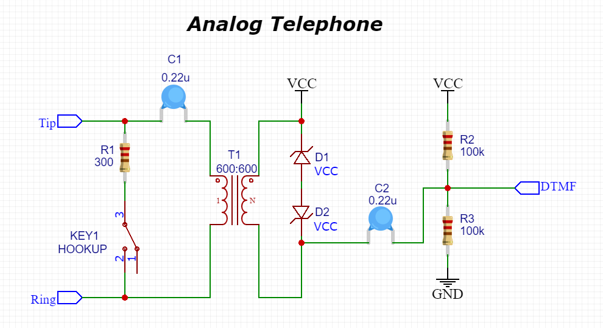

# PhoneDTMF
**Arduino library to detect DTMF without any external devices.**
When you use a MCU to decode a DTMF, you don't need an external device like the MT8870. You just need the ADC input and you will be able to detect the tones with simple algorithms (see Goertzel Algorithm).  
This library is a simple but efficient way to detect telephone tones on microcontrollers like Arduino UNO, ESP8266, ESP32 or Teensy (Teensy has a more powerful library).  


## Use library
~~~~cpp
#include <PhoneDTMF.h>
PhoneDTMF dtmf = PhoneDTMF();
void setup() {
    Serial.begin(9600);
    dtmf.begin(A0);
}
void loop() {
    uint8_t tones = dtmf.detect();
    char button = dtmf.tone2char(tones);
    if(button > 0) {
    	Serial.print(button); Serial.println(" pressed");
    }
    delay(1000);
}
~~~~

###### PhoneDTMF(int16_t sampleCount = 128, float amplify = 1.0f)
> Constructor to init the library.  
> Set ***`sampleCount`*** to define how many times the analog input should be sampled on each request. It must be at least 50 if you want a good result. 50 to 300 are standard values. Higher value gives you a better result but need more time to be executed. 128 samples with a frequence of 6000Hz need 128 \* 1 / 6000 = 21.3ms to be executed. So every call to `detect()` need 21ms.  
> Set ***`amplify`*** if your signal is not good or if your signal does not cover the entire amplitude. Standard values are from 1.0 to 4.0, if you need to amplify it more than 4 times, it would be better to put an opamp on your circuit.

###### uint16_t begin(uint8_t sensorPin, uint32_t maxFrequence = 0)
> begin the library  
> ***`sensorPin`*** is the analog pin used to detect the DTMF, must be an anlog pin.  
> ***`maxFrequence`*** is the frequence you want to use for detecting the signal. Leave 0 to use the maximal frequence available on your microcontroller or set the desired frequence (example 6000 for 6kHz).  
> Returns the real frequence (&lt;=MAX_FREQ) used to detect the signal.  

###### uint8_t detect(float* pMagnitudes = NULL, float magnitude = -1.0f)
> Call this function, every time you want measure the signal. As this is a sync-function, it need some times (~20ms) to return a value. After calling this function, you can use `getRealFrequence()` to see if it was done in the right time (just for a better result), this should be the same frequence as the one returned by the `begin()` function.  
> ***`pMagnitudes`*** is a pointer to an array to 8 floats. It returns the magnitudes of the 8 tones measured. Leave empty or NULL if you don't need the values.  
> ***`magnitude`*** is the minimum magnitude for detecting the tones. If a tone is detected, only 2 frequences are over this magnitude. With 12bits, 128 samples and 6000Hz this should be around 2000. If you are not sure, just leave -1 or empty, so it will try to set this value automatically.  
> Returns the tones detected as 8-bit number (example: 0010 0001)  
> **Remarks**: the tones detected must be exactly 2! If only 1 or 3 or 4 tones are detected, the detection failed or there wasn't a real DTMF tone to detect.  

###### char tone2char(uint8_t dtmf)
> If you want to decode the tones to the phone button, call this function.  
> ***`dtmf`*** is the value of the detected tones (see `detect()`)   
> Returns the character of your phone (example '1' or '#') or 0 if the tones are not valid.   


___
*There are also some utility functions, to get some debug informations:* 


**`uint32_t getSampleFrequence()`** returns the maximal sample frequence of your microcontroller (should be at least 6000Hz, if you want use this library)  
**`uint32_t getRealFrequence()`** returns the current frequence of sampling (should be less or equal to MAX_FREQ)  
**`uint16_t getAnalogCenter()`** returns the analog center of the measurements => when nothing is detected. This value is measured at beginning, when `begin()` is called  
**`uint16_t getBaseMagnitude()`** returns the magnitude when nothing is detected, detected when `begin()` is called  
**`uint16_t getMeasurementTime()`** returns the time, the `detect()` function will need to be executed. It is just a calculation (frequence * samples), it is not measured.  

### ESP32 tips:

**analog inputs**: Do not use ADC2 channels if you use WiFi, because they will be disabled. Use one of the ADC1 channels, like A0-A7:  
```cpp
#include <driver/adc.h>
void setup()
{
    adc1_config_width(ADC_WIDTH_BIT_12); // set 12 bit (0-4096)
    adc1_config_channel_atten(ADC1_CHANNEL_0, ADC_ATTEN_DB_0); // do not use attenuation
    dtmf.begin((uint8_t)ADC1_CHANNEL_0_GPIO_NUM); // Use ADC 1, Channel 0 (GPIO36 on Wroom32)
}
```
**generate DTMF**: ESP32 is enough powerful to generate also DTMF tones on the DAC output, but this will not be described here, just to know that the ESP can detect the DTMF tones but is also able to send them to the thelephone line.  


## Circuit
Just remember that you have to filter out the DC compoment and that the signal peaks should stay between 0V and VCC. You can break the ADC input of your microcontroller.  
So, to remove the DC voltage, add a capacitor (2.2uF) before you connect the line to your input.  
2 Zener  diodes and an opamp would are also good components to protect it. But if you are sure to have a right signal, you can measure directly on the bus.  
If you want to see some circuits, for example how to connect your Arduino directly to your analog telephone, check the <a href='circuits/'>**Circuits manual**</a>.  

<a href="circuits/"></a>  


## Goertzel Algorithm
The Goertzel algorithm is a technique in digital signal processing (DSP) for efficient evaluation of the individual terms of the discrete Fourier transform (DFT).  
https://en.wikipedia.org/wiki/Goertzel_algorithm

Since the DTMF frequences are well known and are only 8 (for the phone), the algorithm can be shortened a little bit. This is the case in this library.  

## Links
Original code from this library: https://forum.arduino.cc/index.php?topic=121540.0  

DTMF on Wikipedia: https://en.wikipedia.org/wiki/Dual-tone_multi-frequency_signaling  

Nice documentation about DTMF: https://www.mdpi.com/2076-3417/9/3/422/pdf  

Frequence filtering: http://dataandsignal.com/frequency-detection/  


## Credits
This library is based on the code written by Jacob Rosenthal (June, 2012) that is based on the Kevin Banks code found at http://www.eetimes.com/design/embedded/4024443/The-Goertzel-Algorithm  

It was then modified by by El_Supremo and optimized for DTMF and Arduino UNO (December, 2016), see https://forum.arduino.cc/index.php?topic=121540.0  

Now, this library was modified to work with other processors too and with the possibility to detect the tones without find out the magnitude.  
