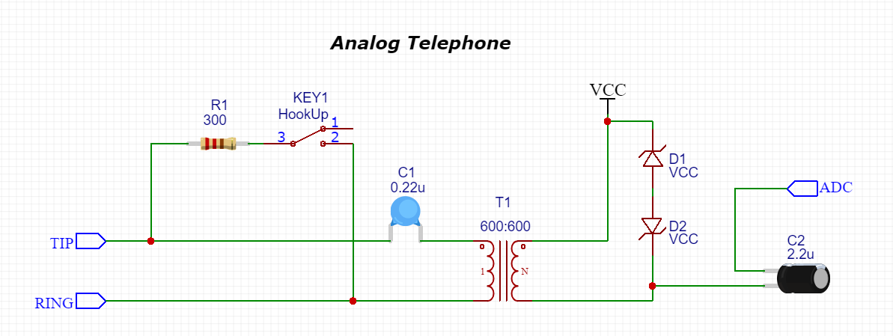

# Circuits
### Analog phone

#### Hook up
The landline circuit is relatively simple. What you need is a 300Ω and a switch to hook up the phone. Once it is ringing, you have to hook up over the switch and you will be able to listen. Switch off to hang up your phone.

#### Audio filtering
Between Tip and Ring you have `-48V DC` in idle and `-48V DC + 90V AC` when it is ringing. Once you hook up, you just have -9V with the audio signal over this DC.  
So, if you want just the audio signal, put a capacitor of 0.22μF to remove the DC component and an audio transformer 600:600 to have an isolation between the high voltage line and your microcontroller.

#### ADC
Now the last part: let say you are powering your microcontroller with VCC (3.3V or 5V). To protect your input, set 2 zener diodes (3.3V or 5V) to VCC, so you will never go over this voltage. Since the ADC need a good input, set one transformer output to VCC and the other to your ADC. And also here, since you need to measure the ADC and don't want the DC component, just insert a capacitor of 0.22μF or 0.39uF to be sure to exclude the DC component.

#### READY!
You can still optimize this circuit, to make it more stable and filter the signal a little bit better (for example put a 100k resistor to VCC and a 100k resistor to GND just before the ADC pin, so the ADC center will be exactly VCC/2).

### Analog Telephone Note
When it is ringing, you have a 90V AC component on your transformer. So you will have 90V AC also over your diode. They are really important! You don't have really a current, you just have a high voltage. Once you hook up, you will have an analog signal with an amplitude of ~0.4-0.8V. Probably you would detect it without C2, R2 and R3. They just gives you a better and regulated signal.
